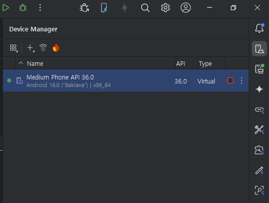
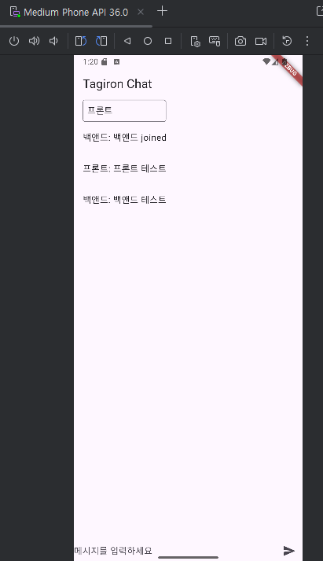

# tagiron frontend

tagiron project

## 프론트 개발 환경

---

Flutter (3.35.1)
 - https://docs.flutter.dev/get-started/install
 - C 드라이브에 해제 (C:\flutter)
 - 환경 변수 설정 (Path - C:\flutter\bin)

Android Studio (2025.1.2)
 - https://developer.android.com/studio?gclid=EAIaIQobChMIh9L9jqeM_QIVBNdMAh0ZcwCvEAAYASAAEgKKl_D_BwE&gclsrc=aw.ds&hl=ko
 - Flutter plugin 설치

---

- 본인 루트 프로젝트 디렉토리에서 https://github.com/jiseok1378/tagiron , https://github.com/sudong111/tagiron-frontend clone
- tagiron 서버 구동시 UserMapper.java 주석처리 (처리 예정)
- frontend 디렉토리에서 cmd 에 'flutter doctor' -> flutter pub get -> flutter run 하면 실행됨

---

## Android emulator

---

- (intellij 기준) android studio 에서 frontend 로 프로젝트 열기
- 오른쪽 상단에 device manager 에서 실행하고, running device 에서 확인

